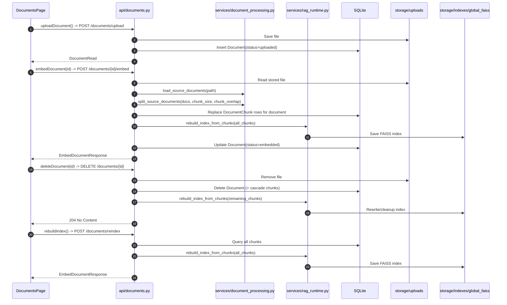
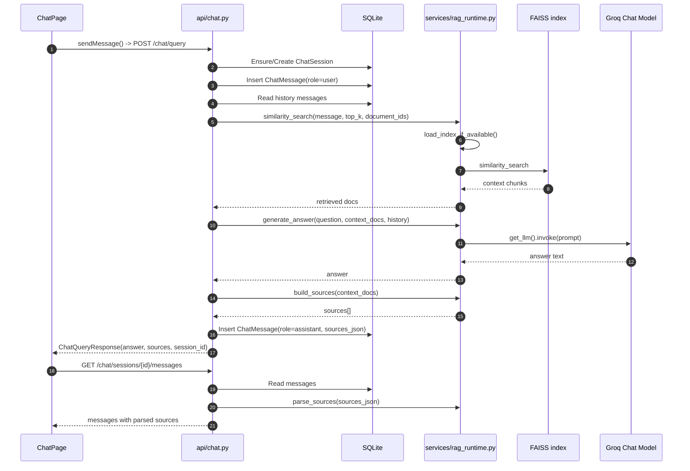

# Current System Flow (Mermaid)

This document describes the current flow of all implemented features and how modules/functions connect.

## 1) Fullstack App Call Graph (React + FastAPI)

```mermaid
graph TD
  subgraph FE[app-frontend]
    FE_APP[src/App.jsx::App]
    FE_CHAT[src/pages/ChatPage.jsx::ChatPage]
    FE_DOC[src/pages/DocumentsPage.jsx::DocumentsPage]
    FE_API[src/api.js::axios api client]

    FE_CHAT_FS[fetchSessions]
    FE_CHAT_FM[fetchMessages]
    FE_CHAT_CS[createSession]
    FE_CHAT_DS[deleteSession]
    FE_CHAT_SM[sendMessage]

    FE_DOC_FD[fetchDocuments]
    FE_DOC_UP[uploadDocument]
    FE_DOC_ST[saveTitle]
    FE_DOC_EM[embedDocument]
    FE_DOC_DD[deleteDocument]
    FE_DOC_RI[rebuildIndex]
  end

  subgraph BE[app-backend]
    BE_MAIN[app/main.py::FastAPI app]
    BE_STARTUP[on_startup]
    BE_DB_INIT[db.py::init_db]
    BE_DB_DEP[db.py::get_db]

    DOC_LIST[api/documents.py::list_documents]
    DOC_UPLOAD[api/documents.py::upload_document]
    DOC_GET[api/documents.py::get_document]
    DOC_UPDATE[api/documents.py::update_document]
    DOC_DELETE[api/documents.py::delete_document]
    DOC_EMBED[api/documents.py::embed_document]
    DOC_REINDEX[api/documents.py::rebuild_global_index]

    CHAT_SESSIONS[api/chat.py::list_sessions]
    CHAT_CREATE[api/chat.py::create_session]
    CHAT_DELETE[api/chat.py::delete_session]
    CHAT_MESSAGES[api/chat.py::list_messages]
    CHAT_QUERY[api/chat.py::query_chat]

    S_LOAD[services/document_processing.py::load_source_documents]
    S_SPLIT[services/document_processing.py::split_source_documents]

    S_REBUILD[services/rag_runtime.py::rebuild_index_from_chunks]
    S_SEARCH[services/rag_runtime.py::similarity_search]
    S_GEN[services/rag_runtime.py::generate_answer]
    S_SRC[services/rag_runtime.py::build_sources]
    S_PARSE[services/rag_runtime.py::parse_sources]
    S_LLM[services/rag_runtime.py::get_llm]
    S_EMB[services/rag_runtime.py::get_embeddings]
    S_INDEX[services/rag_runtime.py::load_index_if_available]

    DB_SQL[(SQLite app.db)]
    FS_UPLOADS[(storage/uploads)]
    FS_INDEX[(storage/indexes/global_faiss)]
    GROQ[(Groq API)]
  end

  FE_APP --> FE_CHAT
  FE_APP --> FE_DOC
  FE_CHAT --> FE_API
  FE_DOC --> FE_API

  FE_CHAT_FS -->|GET /chat/sessions| CHAT_SESSIONS
  FE_CHAT_FM -->|GET /chat/sessions/{id}/messages| CHAT_MESSAGES
  FE_CHAT_CS -->|POST /chat/sessions| CHAT_CREATE
  FE_CHAT_DS -->|DELETE /chat/sessions/{id}| CHAT_DELETE
  FE_CHAT_SM -->|POST /chat/query| CHAT_QUERY

  FE_DOC_FD -->|GET /documents| DOC_LIST
  FE_DOC_UP -->|POST /documents/upload| DOC_UPLOAD
  FE_DOC_ST -->|PUT /documents/{id}| DOC_UPDATE
  FE_DOC_EM -->|POST /documents/{id}/embed| DOC_EMBED
  FE_DOC_DD -->|DELETE /documents/{id}| DOC_DELETE
  FE_DOC_RI -->|POST /documents/reindex| DOC_REINDEX

  BE_MAIN --> BE_STARTUP --> BE_DB_INIT
  DOC_LIST --> BE_DB_DEP
  DOC_UPLOAD --> BE_DB_DEP
  DOC_GET --> BE_DB_DEP
  DOC_UPDATE --> BE_DB_DEP
  DOC_DELETE --> BE_DB_DEP
  DOC_EMBED --> BE_DB_DEP
  DOC_REINDEX --> BE_DB_DEP
  CHAT_SESSIONS --> BE_DB_DEP
  CHAT_CREATE --> BE_DB_DEP
  CHAT_DELETE --> BE_DB_DEP
  CHAT_MESSAGES --> BE_DB_DEP
  CHAT_QUERY --> BE_DB_DEP

  DOC_UPLOAD --> FS_UPLOADS
  DOC_UPLOAD --> DB_SQL
  DOC_LIST --> DB_SQL
  DOC_GET --> DB_SQL
  DOC_UPDATE --> DB_SQL

  DOC_EMBED --> S_LOAD --> FS_UPLOADS
  DOC_EMBED --> S_SPLIT
  DOC_EMBED --> DB_SQL
  DOC_EMBED --> S_REBUILD

  DOC_DELETE --> DB_SQL
  DOC_DELETE --> FS_UPLOADS
  DOC_DELETE --> S_REBUILD
  DOC_REINDEX --> S_REBUILD

  S_REBUILD --> S_EMB
  S_REBUILD --> FS_INDEX

  CHAT_SESSIONS --> DB_SQL
  CHAT_CREATE --> DB_SQL
  CHAT_DELETE --> DB_SQL
  CHAT_MESSAGES --> DB_SQL
  CHAT_MESSAGES --> S_PARSE

  CHAT_QUERY --> DB_SQL
  CHAT_QUERY --> S_SEARCH
  CHAT_QUERY --> S_GEN
  CHAT_QUERY --> S_SRC

  S_SEARCH --> S_INDEX --> FS_INDEX
  S_SEARCH --> S_EMB

  S_GEN --> S_LLM --> GROQ
```

## 2) Document Management Detailed Flow



## 3) Chat + Memory Detailed Flow



## 4) RAG Package Call Graph (rag/* modules)

```mermaid
graph TD
  CLI[rag/run_naive_rag.py::main]
  ARGS[parse_args]
  CFG[rag/config.py::NaiveRAGConfig]
  PIPE[rag/pipeline.py::NaiveRAGPipeline]

  BE[build_embeddings]
  BVS[build_or_load_vectorstore]
  BCH[build_chains]
  ASK[ask]
  EVAL[evaluate]

  E_FACTORY[rag/embeddings.py::create_embeddings]
  E_HF[create_huggingface_embeddings]

  L_DOC[rag/loaders.py::load_documents]
  L_PDF[load_pdf_documents]
  L_TXT[load_text_documents]

  SPLIT[rag/splitter.py::split_documents]

  V_BUILD[rag/vectorstore.py::build_faiss_vectorstore]
  V_SAVE[save_faiss_vectorstore]
  V_LOAD[load_faiss_vectorstore]
  V_RET[create_retriever]

  LLM[rag/llm.py::create_groq_llm]
  P_PROMPT[rag/chain.py::build_prompt]
  C_MAIN[build_rag_chain]
  C_SRC[build_rag_chain_with_sources]

  EV_COL[rag/evaluation.py::collect_predictions]
  EV_DATA[build_ragas_dataset]
  EV_RUN[evaluate_with_ragas]

  CLI --> ARGS --> CFG
  CLI --> PIPE
  CLI --> BVS
  CLI --> BCH
  CLI --> ASK

  PIPE --> BE --> E_FACTORY --> E_HF
  PIPE --> BVS
  BVS --> L_DOC
  L_DOC --> L_PDF
  L_DOC --> L_TXT
  BVS --> SPLIT
  BVS --> V_BUILD
  BVS --> V_SAVE
  BVS --> V_LOAD
  BVS --> V_RET

  PIPE --> BCH --> LLM
  BCH --> P_PROMPT
  BCH --> C_MAIN
  BCH --> C_SRC

  PIPE --> EVAL --> EV_COL
  EVAL --> EV_DATA
  EVAL --> EV_RUN
```



## 5) Utility Script Flow (Groq model list)

```mermaid
graph LR
  G_FILE[get_groq_model.py]
  G_KEY[api_key from source/env]
  G_REQ[requests.get]
  G_URL[https://api.groq.com/openai/v1/models]
  G_PRINT[print(response.json())]

  G_FILE --> G_KEY --> G_REQ --> G_URL
  G_REQ --> G_PRINT
```
